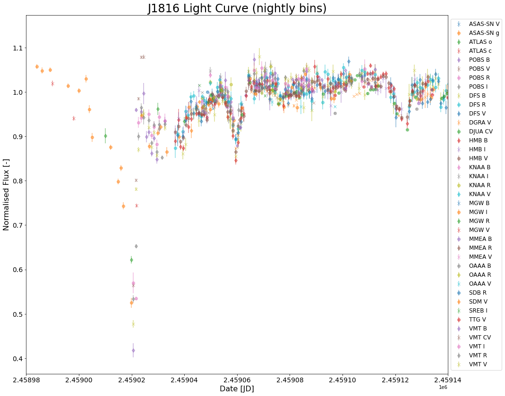

# Public

This folder is intended for all those people not interested in the script files and data reductions but are interested in the discovery, analysis and results.

## Discovery

The discovery of J1816 was made by Z. Way et al. 2020 (ATel #13818 - http://www.astronomerstelegram.org/?read=13818) using data collected from ASAS-SN.
The star showed a sudden steep decline in magnitude that was highly asymmetric. On discovery this star was mentioned in a tweet and picked up by my supervisor (Matt Kenworthy - Leiden Observatory) and I (Dirk van Dam - Leiden Observatory).

We are specifically interested in planet formation focused on the discovery and characterisation of circumplanetary disks / ring-systems and anything with an asymmetric eclipse must be indicative of non-spherical occulter, which produces the possibility that the object is a forming planet in an inclined, tilted and possibly offset (impact parameter &ne; 0) from the star's centre. As soon as sub-structure appears it could be indicative of several rings.

Upon this discovery an observation campaign was set-up with the AAVSO (see the Alert Notice 710 - https://www.aavso.org/aavso-alert-notice-710, and the forums: Young Stellar Objects - https://www.aavso.org/asassn-v-j181654-202117-campaign-01, and the campaign forum - https://www.aavso.org/asassn-v-j181654-202117-campaign).

## AAVSO Campaign

Following the setting-up of the observing campaign, several observers took it upon themselves to set their scopes on J1816 and provide data in different filters and different cases.
 
Visual observations were performed by Luiz Antonio Araujo (ALRB).

Johnson B filter observations were performed by Sjoerd Dufoer (DFS), Franz-Josef Hambsch (HMB), Nathan Krumm (KNAA), Gordon Myers (MGW), Mervyn Millward (MMEA), the Al Sadeem Astronomy Observatory (OAAA), Erik Schwendeman (SDM), Tonny Vanmunster (VMT) and Timothy Weaver (WTIC).

Johnson V filter observations were performed by Francisco Cuevas Naranjo (CFJB), DFS, Grzegorz Duszanowicz (DGRA), HMB, KNAA, MGW, MMEA, Michael Miller (MMGA), OAAA, SDM, Andars Timar (TIA), Thiam Guan Tan (TTG), VMT and WTIC.

Cousins R filter observations were performed by CFJB, DFS, HMB, KNAA, MGW, MMEA, OAAA, Don Starkey (SDB) and VMT.

Cousins I filter observations were performed by HMB, KNAA, MGW, SDM, Richard Schmidt (SREB) and VMT.

Sloan g filter observations were performed by Peter Nelson (NLX).

Open (no) filter observations reduced to V magnitudes (CV filter) were performed by Juan Francisco Calvo Fernandez (CJUC), DFS, Juan Pablo Dos Santos (DJUA) and VMT.

Data collected from these observers can be found on the AAVSO website by looking for ASASSN-V J181654.06-202117.6 and is still being collected at this moment.

## Professional Telescopes

The archival data from survey telescopes was added to this load of data. The data comes from ASAS (private communication), ASAS-SN (publicly available), ATLAS (private communication), Evryscope (private communication) and the Perth Observatory (proposal time).

This significantly extends the light curve producing the following plot.

Note 1: ASAS data has been separated by field (as each has varying offsets w.r.t. the other field).
Note 2: not all the amateur observers mentioned are in the legend, and this is because data was only plotted for an observer if they provided more than 10 data points.

## Light Curve Analysis

With this incredible stream of data it is possible to do significant analysis of the light curve.

### Stellar Variability

The first step of any analysis is to try and remove any variability of the star.
This was performed by looking at the data with the highest cadence (most number of observations per night) for the longest baseline (largest number of nights observed).
Thus the stellar variability was modelled using the V band data acquired by DGRA.
First the short term variability (i.e. the stellar variability) was smoothed out using a boxcar kernel to remove the flux variations due to the eclipsing object.
This smoothed data was removed from the actual data leaving just the stellar variability.
This was then fit with 10 sinusoids providing a model for the stellar variability, which was then compared to the other high cadence V band data and then to other high cadence data in the other bands.

| Image 1              | Image 2              |
|----------------------|----------------------|
| | |
| | |
| | |
| | |
|||

Note that this model must be performed on the flux values of the star (not the magnitude) and this is the reason why the light curve is in flux.

### Light Curve Cleaning

Before all the data can be combined to produce one light curve showing the key features of the eclipse due to the eclipsing object several "cleaning" steps must be applied.

1) <strong>Convert Magnitudes to Normalised Flux</strong>: this is necessary for the stellar variability model.

2) <strong>Remove High Error Data</strong>: we remove all data with high errors (2.5%).

3) <strong>Remove Stellar Variation</strong>: this removes any deviations in the light curve due to the variability of the star.

4) <strong>Remove Outliers</strong>: sometimes there are obvious outliers in the data (i.e. a star becomes 50% brighter for 5 minutes, or on one night 4 observers see the star do nothing interesting and one sees a 30% drop). These are removed.

5) <strong>Binning the Data (per observer per band)</strong>: nightly bins are performed to reduce scatter. 

6) <strong>Aligning the Data (per observer, per band)</strong>: sometimes due to for example camera sensitivities, differences in the manufacturing quality of the filters, moon/background influences, choice of reference stars...etc. it is possible that the measurements of one observer are offset w.r.t. another one. To see this very clearly plot a light curve of J1816 with the AAVSO web interface and compare the data submitted by DFS and HMB (similar cadence, clear offset in multiple filters). We therefore look at all the data in one band and try to align the different observers to reduce the scatter of the light curve. <em>This is done by eye</em>.

7) <strong>Remove High Error Data (per band)</strong>: we remove all data with high errors (2.0%).

8) <strong>Remove Outliers (per band)</strong>: due to the alignment some outliers might pop out more clearly now and must again be removed.

9) <strong>Rebinning the Data (per band)</strong>: we perform a nightly bin for each band.

10) <strong>Final Alignment (per band)</strong>: finally we need to align the different photometry per band w.r.t. each other. Due to the previous alignments performed the bands may no longer be aligned w.r.t. each other. So we perform flux shifts (<em>again by eye</em>) to align the data. Note that we want to align the data for the quiescent star (i.e. not during the eclipse), because we want the normalised flux of the star to be independent of colour. This enables us to determine whether the eclipse depth as colour dependent, which provides insight into the composition of the eclipsing objects composition.

### Eclipse Depth Variation

You may notice that the eclipse around JD = 2459060 changes depth w.r.t. colour.
It is deepest in B, then V, then R and presumably then I.
This is indicative of eclipsing object being composed of dust.
<em>Updates forthcoming</em>.

### Steady Rise

You might notice that there is a steady rise in the flux of the star as time passes. 
This is an interesting feature which may be due to the star itself and is currently under investigation through archival data. 
This could be the reason why the eclipse centred about JD = 2459125 shows the eclipse depth variation sometimes being in reverse (I, R, V, B).
<em>Updates forthcoming</em>).

## Prediction

One of the noteworthy things seen here is that we have two eclipses of similar depths (~15%) and similar durations (~8 days), so I made the prediction that the midpoint of the eclipse has passed. 
By taking the point between these two eclipses and reflect the left half of the data over the midpoint I could make a prediction of how the light curve would evolve and compare it to the data being collected.
Doing this produces the following plot.

The cyan line is the prediction for the deepest part of the eclipse, which is on the <strong>9th of November 2020</strong>.
Unfortunately the star also appears to be setting for the season (i.e. the Earth is in a position where the Sun is now between the Earth and J1816) right around this time.
A new call for observers will be issued out shortly including spectroscopy to determine the composition of the dust and hopefully keep track of this star for as long as possible.

## Further Analysis

There is much more analysis to be done.

1) Look in archival data to see if there is evidence of a previous eclipse.

2) There appears to be evidence of a drop and steady rise ocurring in the past in the ASAS-SN photometry.

3) There appears to be evidence of similar eclipses to those noted at JD = 2459055 and JD = 2459125 in ASAS-SN data.

4) Ring models that fit the light curve. Note that these only really make sense once we are certain the eclipse has terminated.

<em>This page was last updated on the 27th of October 2020</em>. 
